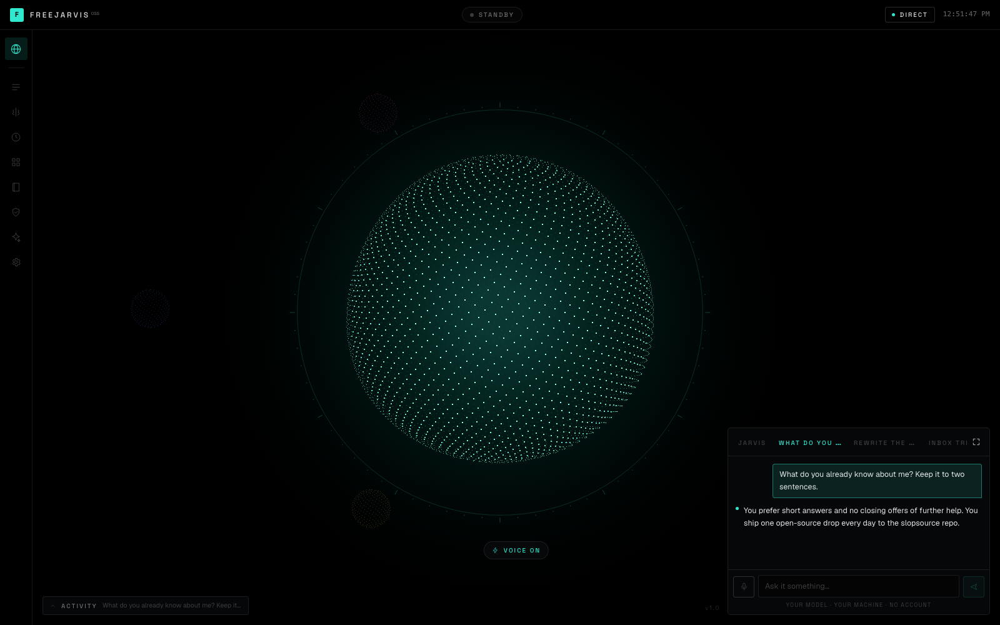
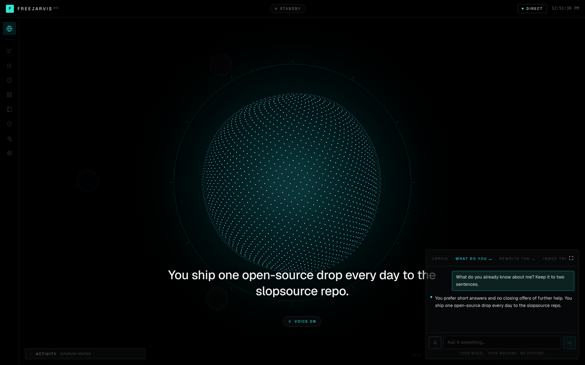
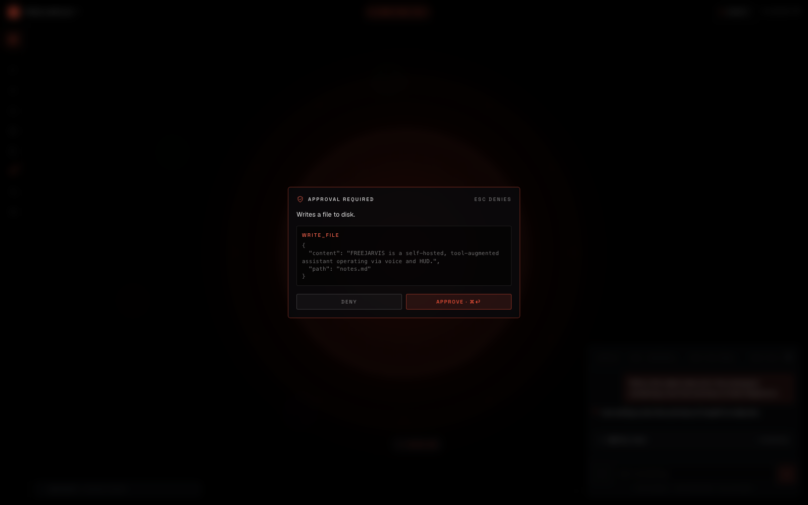
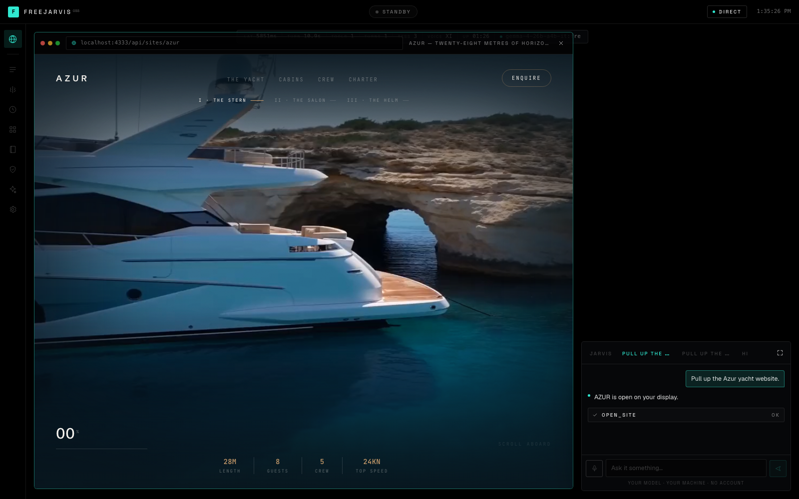
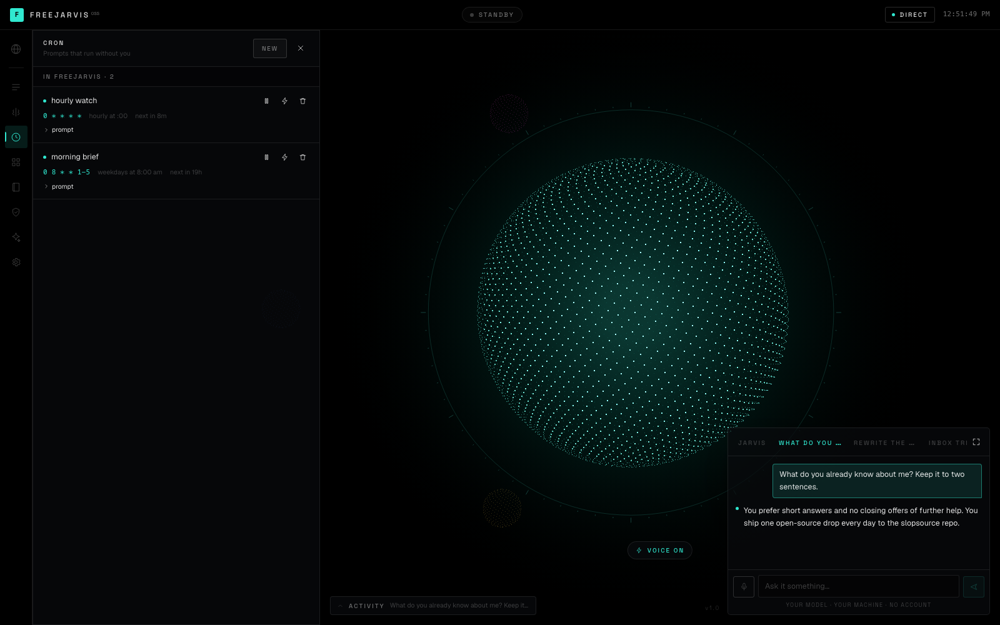
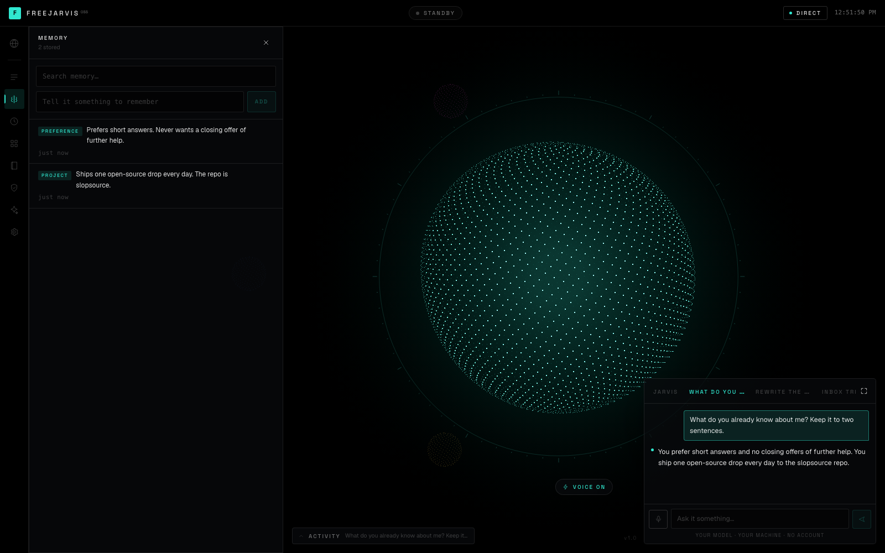
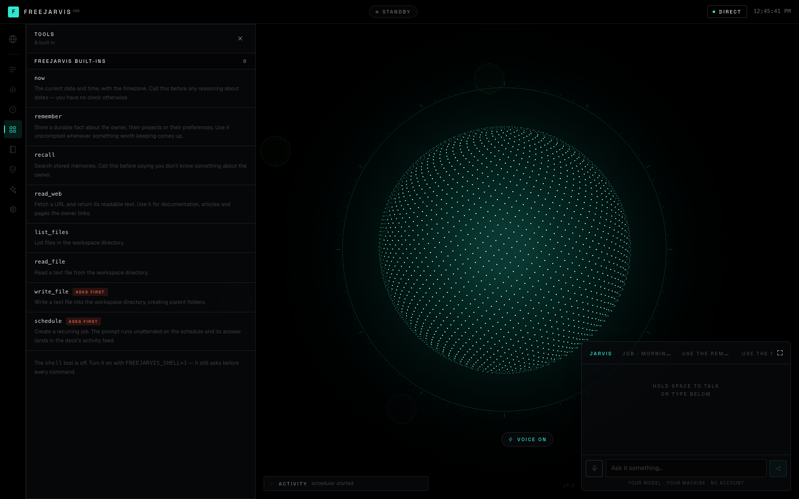
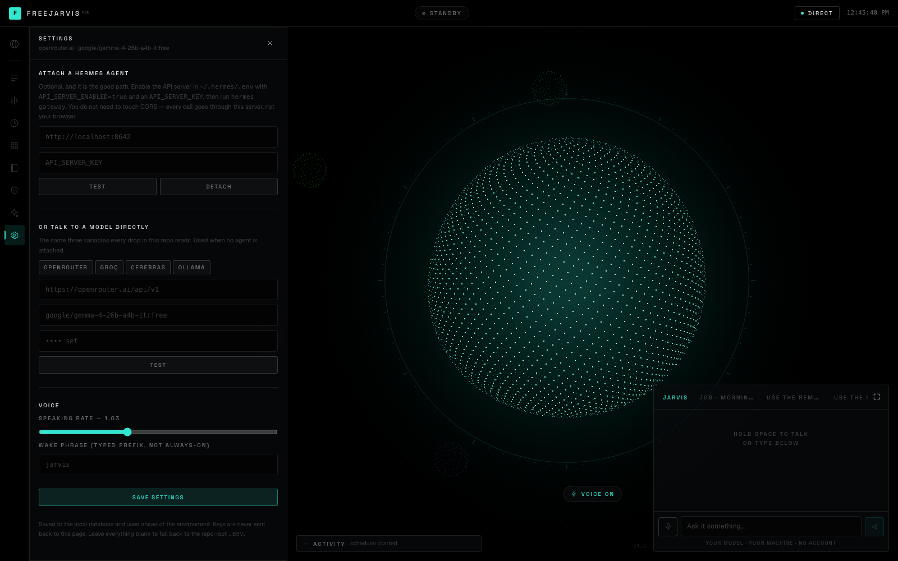
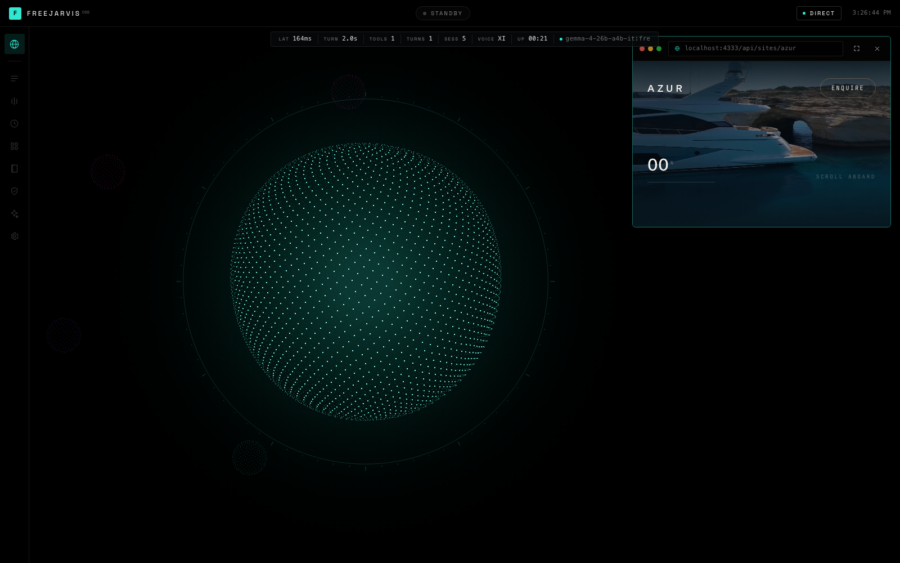

# freejarvis

**A command deck for your own agent.** Replaces **Martin** and the rest of the $20–40/month
"personal AI OS" tier. Part of [Openware](https://github.com/openwarehq) — software you own
outright.

Talk to it. It answers out loud, one sentence at a time, across a caption line you can read
from the other side of the room. It runs tools, remembers what you tell it, and stops to ask
before it touches anything real. No account, no credits, no per-minute transcription bill.

The brain is yours: attach a self-hosted [Hermes Agent](https://hermes-agent.nousresearch.com)
and freejarvis becomes its face — its sessions, cron jobs, skills, toolsets and approvals, all
live. Attach nothing and it runs its own loop against any OpenAI-compatible model.

```bash
git clone https://github.com/openwarehq/freejarvis
cd freejarvis
cp .env.example .env   # add a model — free key, no card, about a minute
docker compose up
# http://localhost:4333
```



---

## What this doesn't do

Read this part first.

- **Speech recognition is the browser's, and in Chrome and Edge that means the audio goes to
  Google.** This is the one place in the drop where anything leaves your machine, it only
  happens while you are holding the talk key, and it is worth knowing before you hold it.
  Safari recognises on-device. Firefox has no recognition at all and the deck falls back to
  typing. Text-to-speech is local in every browser. If you want fully offline voice, this is
  the piece to replace, and it is one hook — `src/hooks/useVoice.ts`.
- **There is no wake word.** Hold space, or click the mic. Always-on listening means an open
  microphone and a recognition stream running all day, which is a different product and a
  different privacy conversation.
- **ElevenLabs is optional, and it is a paid service.** freejarvis speaks through your browser
  by default — free, offline, no key, and it sounds like it. Give it an `ELEVENLABS_API_KEY`
  and it sounds like a product. That key is a bill you pay ElevenLabs per character, and it is
  the one place a subscription can get back into this drop. It is opt-in, it is never required,
  and nothing degrades without it except the timbre. There is still no freejarvis account.
- **On the browser voice, the orb's motion while speaking is synthesised, not measured.**
  `speechSynthesis` exposes no waveform, so the amplitude comes off word-boundary events with a
  decay between them — close, but not the speech. On ElevenLabs the audio is a real stream
  through an AnalyserNode, so the orb is the actual voice.
- **The site viewer displays sites; it does not build them.** `open_site` frames an `.html`
  file that already exists in the folder you pointed `SITES_DIR` at. If you want a model to
  *write* the site, that is [unlovable](https://github.com/openwarehq/unlovable).
- **It does not read your inbox, run your calendar, or make phone calls.** Martin does, and
  that is a real difference. freejarvis drives an agent — give the agent those tools, which is
  what Hermes skills are for, and it can. Out of the box it has eight tools, and none of them
  is your email.
- **The scheduler lives in the web process.** Nothing fires while the container is down, and a
  job interrupted mid-run does not resume — it runs again at its next scheduled time. A queue
  that needs its own service would be a second command, and the bar here is one.
- **One brain at a time.** Setting `HERMES_URL` takes precedence; the direct model is what you
  get when no agent is attached. There is no routing between them.
- **The deck has no login.** It binds to localhost and assumes the only person who can reach
  port 4333 is you. Do not put it on the open internet without something in front of it.
- **Hermes panels only show what your Hermes build actually serves.** Toolsets, skills and jobs
  are read from `/v1/toolsets`, `/v1/skills` and `/api/jobs`; an older build without one of
  those gets a panel that says so, rather than an empty table that reads as an agent with
  nothing in it.
- **Memory is a list with substring search, not embeddings.** For a few hundred facts about
  one person that is the right amount of machinery. It is not a RAG system.
- **Tool calling is only as good as your model.** See *Tested models* below — the free tier
  default works, and it is not equally reliable at everything.

---

## What it does

**Two brains, one face.** The deck does not know which one it is talking to. Both emit the same
event vocabulary — `assistant.delta`, `tool.started`, `tool.completed`, `approval.required` —
so every panel, the caption line and the orb work identically either way.

| | Attached to Hermes | On its own |
|:--|:--|:--|
| Chat | Hermes' agent loop, its memory and skills | freejarvis' loop |
| Sessions | Hermes sessions + a local mirror | local SQLite |
| Cron | Hermes jobs, which can deliver to Telegram or Discord | in-process scheduler |
| Tools | whatever your agent has | eight built-ins, plus `open_site` and `shell` when enabled |
| Skills | yours | — |
| Approvals | Hermes `run_approval` | local gating |

**Voice both ways, and hearing costs nothing ever.** Hold space, talk, let go. Recognition is
the browser's — no Whisper key, no minutes, no transcription bill, and there is no paid tier of
this that listens better. Speaking is the browser's too until you hand it an ElevenLabs key, at
which point it starts on the first finished *sentence* rather than the last one, and fetches the
next clip while the current one plays so the queue never gasps.

**Ask for a site and it appears.** Point `SITES_DIR` at a folder of `.html` files and every one
of them becomes something you can ask for out loud. The available names are compiled into the
tool's own description, which is the part that makes "pull up the Azur site" resolve instead of
guess. It opens **windowed in the top-right corner** so the orb stays on screen next to it —
expanding to the full frame is a deliberate click — and the chat dock stays live either way, so
you can ask for the next thing without closing this one.

**The orb is a readout, not decoration.** Five thousand points on a sphere, and every property
is bound to something real — spin rate and displacement to what the agent is doing, the radial
wave to microphone amplitude, and the hue of the *entire interface* to the current state.
Standby is teal. Thinking is violet. Working is green. Waiting on you is red.

 

**It stops before it does anything real.** `write_file` and `schedule` pause the run — genuinely
pause it, the stream stays open — and show you the exact arguments. Approving `write_file`
tells you nothing; approving `write_file {"path":"notes/today.md"}` tells you everything.

**Cron that reads like English.** `0 8 * * 1-5` renders as *weekdays at 8:00 am*, with the next
firing time. Scheduled runs have nobody in the room, so gated tools are refused rather than
queued for an approval that will never come, and the answer lands in the activity feed.



**It boots like something.** Every line of the start-up sequence is a real check against a real
endpoint — brain reachable, tools loaded, jobs armed, memories stored, voice engine. It looks
like a title sequence because the numbers happen to be interesting. If the agent is unreachable,
this is where you find out, and the line goes red and stays.

**The readout is measured.** Latency is wall-clock from send to first token — the number you
actually feel — not a token count dressed up as speed.

 

**SOUL.md, borrowed on purpose.** Hermes keeps an identity file at `~/.hermes/SOUL.md`, so
anyone arriving from there already knows what this file is. Edit it in the app; it is the whole
personality on a direct model and layers on top of your agent's own when one is attached.

---

## Attaching a Hermes Agent

Hermes ships an OpenAI-compatible API server. It is off by default. In `~/.hermes/.env`:

```bash
API_SERVER_ENABLED=true
API_SERVER_KEY=$(openssl rand -hex 32)
```

Then run the gateway, which prints the port it is on:

```bash
hermes gateway
# [API Server] API server listening on http://127.0.0.1:8642
```

Point freejarvis at it — in the Settings panel, or in the repo-root `.env`:

```bash
HERMES_URL=http://localhost:8642
HERMES_KEY=<the same API_SERVER_KEY>
```

**You do not need to configure CORS.** Hermes does not enable browser CORS by default, and
every call from this deck goes through its own server rather than from the page — which also
means `API_SERVER_KEY` never reaches your browser. `localhost` is rewritten to
`host.docker.internal` inside the container, so the same line works in both places.

Already running Hermes in Docker? Add `API_SERVER_ENABLED=true`, `API_SERVER_HOST=0.0.0.0` and
a key to its environment, and point `HERMES_URL` at the container.

---

## The deck

| | |
|:--|:--|
| **Hold space** | talk; release to send |
| **Enter** | send what you typed |
| **Esc** | stop the voice, then stop the run, then close the panel |
| **⌘⏎** | approve the pending tool |
| **Esc** (on the card) | deny it |

The left rail is Sessions, Memory, Cron, Tools, Skills, Approvals, Soul and Settings. The
spheres in the distance are your other open sessions — one hue each, stable across reloads,
so a conversation keeps its colour.

---

## Tools

Eight built-ins on a direct model, and two more you switch on. Two of them ask first.

| Tool | | |
|:--|:--|:--|
| `now` | the clock | it has none otherwise |
| `remember` | store a durable fact | |
| `recall` | search what it stored | |
| `read_web` | fetch a URL as readable text | no key |
| `list_files` · `read_file` | inside `data/workspace` | |
| `write_file` | inside `data/workspace` | **asks first** |
| `schedule` | create a cron job | **asks first** |
| `open_site` | frame a site on the deck | only when `SITES_DIR` is set |

Every path resolves and is compared against the real workspace root *after* symlinks — a link
planted in the workspace pointing at `/etc` does not work, and neither does `../`.

There is one more, `shell`, and it is off:

```bash
FREEJARVIS_SHELL=1
```

On, it runs commands in the workspace as the container user, and it still asks before every
one. A web page that can run commands on your host is a different threat model than a web page
that can read a file, and the difference should be a line you wrote on purpose.

 

---

## Demo mode

```
http://localhost:4333/?demo=1&script=yacht
```

A scripted take, for filming. The deck runs its real components — the orb is the orb, the voice
really is ElevenLabs, the site really is the file on your disk in a real iframe. The only thing
that comes off the script is *what the agent decides to do*, and every step in it is something
the agent genuinely does when you just ask it.

It exists because a free-tier model returns an empty response about one turn in ten and takes a
variable two to six seconds to think. That is survivable when you are working and fatal when you
are on take nine.

**It records clean.** No controls, no chat dock, no ticker — nothing to crop out. A hint card
names the chords and removes itself after five seconds.

| | |
|:--|:--|
| **⌘⌥⇧A** | fire a take (resets first) |
| **⌘⌥⇧R** | reset |
| **⌘⌥⇧D** | show/hide the controls |

Chords rather than single keys, because during a take the deck is listening to the room and a
stray keypress is a ruined shot.

**The client owns the timing, not the server.** An earlier version paced the stream to each
line's estimated spoken duration so that visual events landed on the right word. Estimating from
character count is off by 15–27% on a short sentence, and every one of those errors is either a
hole in the audio or an event firing while the voice is three lines back. So the whole script
streams as fast as it renders, every clip is fetched the moment its sentence completes, and the
speech queue plays them back to back — **measured at 9–89 ms between clips**. The site opens as
a queued action *between* two real clips, so it lands on the line that announces it rather than
on an estimate of it.

- Scripts live in [`src/lib/demo.ts`](./src/lib/demo.ts) — plain data, edit freely
- A `say` line can use `{tools}` `{memories}` `{jobs}` `{sessions}` `{voice}`, filled in from
  the live system at stream time — so the status report it reads out is the actual status
  report. Delete a job before filming and the line changes
- Length is a character budget, not a step count: the voice reads about fourteen a second, so
  the shipped take is ~170 characters and runs ~12 seconds
- Prefer an em dash to a full stop where you want a beat — a second sentence is a second clip,
  and clips are where seams live

Nothing reaches it by accident. And if someone wants to know whether this actually works, close
it and just use it — that is the better demo.



---

## Configuration

In `.env` — copy `.env.example` and fill in one of the two brains:

```bash
LLM_BASE_URL=https://openrouter.ai/api/v1
LLM_MODEL=google/gemma-4-26b-a4b-it:free
LLM_API_KEY=
```

Point `LLM_BASE_URL` at `https://api.anthropic.com` and it switches wire format itself —
`x-api-key`, the version header, the system prompt hoisted out of the message list, tool
results as content blocks. You configure none of that.

Everything else is optional:

| | |
|:--|:--|
| `HERMES_URL` · `HERMES_KEY` | attach an agent; takes precedence over `LLM_*` |
| `ELEVENLABS_API_KEY` | a voice worth listening to. Paid, opt-in, never required |
| `ELEVENLABS_VOICE_ID` | default `onwK4e9ZLuTAKqWW03F9` — Daniel, British, steady |
| `ELEVENLABS_MODEL` | default `eleven_turbo_v2_5`; `eleven_flash_v2_5` is faster and thinner |
| `SITES_DIR` | a folder of `.html` files the agent can pull up by name |
| `FREEJARVIS_SHELL=1` | enable the shell tool |
| `PORT` | default 4333 |
| `DATA_DIR` | default `./data` — database, `SOUL.md`, workspace |

Anything set in the Settings panel is stored in the database and beats the environment, so you
can hand this to someone who has never opened a `.env`.

---

## Tested models

Measured, not assumed. All over OpenRouter unless noted.

| Model | Chat | Tools | Notes |
|:--|:--:|:--:|:--|
| `google/gemma-4-26b-a4b-it:free` | ✅ | ✅ | The repo default, and what every screenshot here was taken against. Calls tools correctly, including chained calls and the approval pause. **Intermittently returns a completely empty response** — perhaps one turn in ten, more often under a long `SOUL.md`. freejarvis names that instead of going quiet; send it again. |
| Anthropic `claude-*` | — | — | The wire adapter is written and unit-tested. No request has ever been sent to `api.anthropic.com` from this repo, so it is untested against the live API. |
| Ollama, LM Studio, vLLM | — | — | Should work — it is the same OpenAI shape — but tool calling depends on the model you pull, and small local models are the least reliable at it. Not measured. |

The deck degrades honestly: a model that will not call tools still chats, and the tools panel
still lists what it declined to use.

---

## Layout

```
freejarvis/
├── src/lib/
│   ├── events.ts       the one event vocabulary both brains speak
│   ├── runner.ts       picks a brain; nothing above this line knows which
│   ├── agent.ts        the standalone loop — tools, approvals, memory
│   ├── hermes.ts       the Hermes client, feature-detected
│   ├── llm.ts          OpenAI + Anthropic streaming, with tool calls
│   ├── tools.ts        eight built-ins and the workspace jail
│   ├── cron.ts         a five-field cron parser
│   ├── sentences.ts    stream → whole sentences, for the caption and the voice
│   ├── voice.ts        ElevenLabs, server-side so the key stays here
│   ├── sites.ts        the sites folder, and the jail around it
│   └── scheduler.ts    the in-process tick
├── src/components/
│   ├── Orb.tsx         the sphere
│   ├── SiteView.tsx    a site, framed on the deck
│   ├── BootSequence.tsx  real checks that happen to look cinematic
│   └── panels/         one per rail item
└── data/               your database, SOUL.md and workspace — gitignored
```

```bash
npm run dev        # http://localhost:4333
npm test           # 53 tests
npm run typecheck
```

---

MIT — take it, sell it, host it, fork it.

Not affiliated with Nous Research, Martin, or anyone else named here. Hermes Agent is MIT and
belongs to [Nous Research](https://github.com/NousResearch/hermes-agent); this is a separate
program that talks to its public API.
